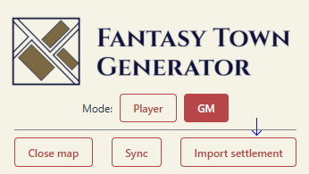

You can integrate FTG settlements into Roll20, allowing GMs and players to use the interactive map, and see buildings
and people.

## Installation

This integration is provided as a browser extension:

- [Chrome link](https://chromewebstore.google.com/detail/fbjnkjgbkdbjmecngofkinnjjafhfpcl?utm_source=item-share-cb)
- [Firefox link](https://addons.mozilla.org/addon/fantasy-town-generator-roll20/)

## Usage guide

Everybody needs to have the browser extension installed. To access the extension controls, click the extension icon in
the browser toolbar:

The GM should ensure they are in the 'GM' mode, and players should be in the 'Player' mode.

### Importing a settlement

#### 1. Set the iframe allowed origins

Premium FTG users can set the allowed iframe origins in the premium settings - this is applied for all settlements. Free
users can set the allowed iframe origins on a per-settlement basis, in the settlement specific settings. For the Roll20
integration, you need to add `https://app.roll20.net` to the allowed origins.

#### 2. Allow public access for the settlement

For the players to see the settlement, you need to enable public access (any level is fine).

#### 3. Export from FTG

Press the Export to Roll20 button from the settlement:

If you've done the above steps, you'll see:

Press the copy to clipboard button.

#### 4. Import into Roll20

Press the "Import settlement" button extension menu. Paste the copied config into the text area that appears, and press
the import button.

Once a settlement has been imported, it will appear in the list below the buttons.

### Using settlement maps in Roll20

#### Open

To open a settlement in Roll20 for all players, press the "Open in Roll20" button in the settlement row in the extension
menu:

This sends a chat message of the form `ftg open $settlementId` into the Roll20 chat, which syncs opening the map for all
players currently connected to Roll20. Ensure this is sent as a public chat message.

#### Sync

Updates in FTG are not automatically synced to other players in Roll20. To manually sync, press the sync button in the
extension menu. This sends a chat message of the form `ftg sync` into the Roll20 chat.

#### Close

To close the map for all players, press the "Close map" button in the extension menu. This sends a chat message of the
form `ftg close` into the Roll20 chat.

#### Alternative

Technically, you don't need to import a settlement into the extension - that only provides the convenient buttons for
the actions described above. If a settlement is configured correctly, you can just use the chat commands directly:

- `ftg open $settlementId`
- `ftg sync`
- `ftg close`

## Why a browser extension, and not a Roll20 mod?

The Roll20 mod API doesn't allow iframes to be added to the page, or for web requests (e.g. to the FTG server) to be
made. Additionally, Roll20 mods require you to have the pro subscription tier.

For these reasons, I opted to build a browser extension that adds an iframe, which can respond to the chat to sync
operations between players.

## Dev guide

Prerequisites: have yarn installed and run `yarn install`.
Tested with node v22.14, yarn v1.15 

### Local development
To run this extension for local development, run:

- `yarn dev` (for chrome)
- `yarn dev -b firefox` (for firefox)

This creates a new directory under the `.output` directory. You can point the browser to load that as a development
extension.

### Production build
To build this extension for production, run:

- `yarn build` (for chrome)
- `yarn build -b firefox` (for firefox)

This creates a new directory under the `.output` directory which can be zipped and uploaded.
